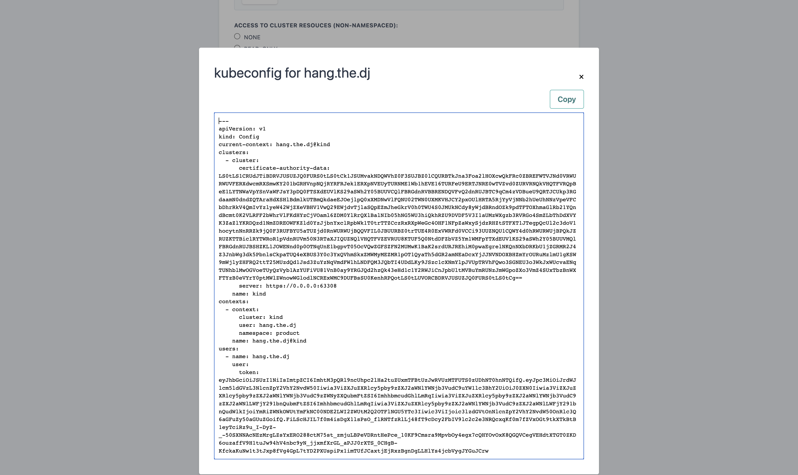
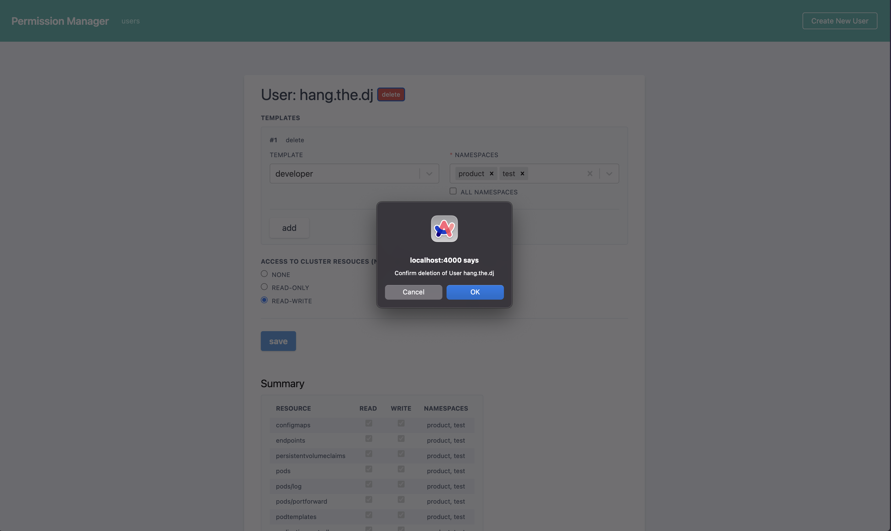

# Permission manager

Welcome to the **Permission Manager**! :tada: :tada:

Permission Manager is an application developed by [SIGHUP](https://sighup.io) that enables a super-easy and user-friendly **RBAC management for Kubernetes**. If you are looking for a simple and intuitive way of managing your users within a Kubernetes cluster, this is the right place.

With Permission Manager, you can create users, assign namespaces/permissions, and distribute Kubeconfig YAML files via a nice&easy web UI.

## Screenshots

### First Page

### Creating a user

### Creating a user - Summary

### User's Kubeconfig

### Deleting a user

## Installation

To deploy and run the Permission Manager on your cluster, follow the [installation guide](docs/installation.md)

## Development Setup

We love contributions from the community :heart:.
Learn [how-to-contribute](docs/how-to-contribute.md)

## FAQ

### How it works

The application allows us to define and select permission standard templates (those defining who can do what, within a namespace or globally) and associate them with all the users you might want to create.

The template system is an abstraction over Cluster-Roles, RoleBinding, and ClusterRolesBindigs.

### What is a template

A template is a ClusterRole with a prefix

`template-namespaced-resources___`

for example
`template-namespaced-resources___developer`

#### Why a template is not a CRD

When we started the development of this project, a template was one-to-one to a `clusterrole`, the usage of a CRD looked overkill. This will obviously change in future to avoid polluting `clusterroles` and will allow us to have a more precise encapsulation of what is owned by the permission manager.

### How to add a new template

Create a clusterrole starting with `template-namespaced-resources___` and apply it.

#### Default templates

`developer` and `operation` default templates are located at deployments/kubernetes/seeds/seed.yml

### What is a user

A user is a custom resource of kind `permissionmanagerusers.permissionmanager.user`

## Commercial & Enterprise Support

Are you using Permission Manager in your clusters and looking for commercial support? Let us know and [get in touch](mailto:sales@sighup.io)
