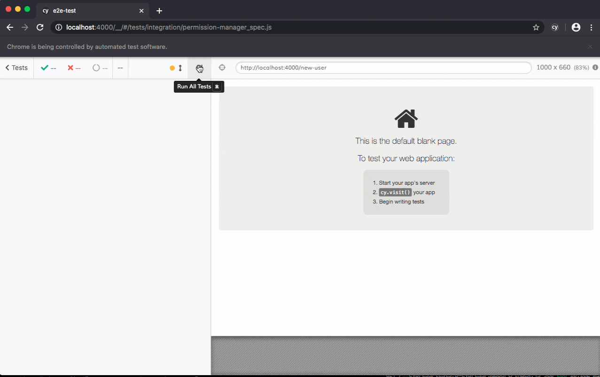

# How to contribute

This guide is for contributors to the Permission Manager development.

## Core concepts

Permission Manager consists of two main components:

- A backend server, written in Go, providing a users access management API built on top fo the K8s APIs
  - users are modeled as CRD objects stored, using the K8s APIs, into ETCD
- An single-page web application, built using the ReactJS framework compiled to a go file using
  [statik](https://github.com/rakyll/statik), so that a single binary can be deployed to the K8s cluster.

Operators of the cluster can define permissions templates to be used by Permission Manager to create new Users
declaring in the cluster `ClusterRole` objects with the following naming convention:
`template-namespaced-resources___<template-name>`.

Note that in a future version of the software, the current naming convention will be replaced by CRDs and/or labels

## Development environment

### Requirements

- nodejs (developed on v13.1.0)
- [kind](https://github.com/kubernetes-sigs/kind) (v0.9.0)
- make 4.1
- go 1.14.2
- npm 6.14.4
- yarn 1.22.11
- yq 3.3.0
- kubectl 1.16.6
- curl 7.58.0
- bats


### Setup a local development cluster

Permission Manager development requires access to a K8s cluster.
The easiest way to create a local Kubernetes cluster is to use [kind](https://github.com/kubernetes-sigs/kind).

To create a local kind cluster, run the `make kind-cluster` command. 

### Approach A: Local development

#### Limitations

- backend doesn't serve react bundle

#### How to start

```shell script
make development-up
```

Please note that the frontend container will install node_modules after the boot, so it could take some time to spin completely

#### Teardown

```shell script
make development-down
```

### Approach B: Build Docker Image and deploy it on kind
 
#### TL;DR
```
kind create cluster --config=./development/kind-config.yml --kubeconfig=./.kubeconfig
source .env-cluster
make seed build deploy 
make port-forward &
```
#### Step explanation

- The `kind create cluster` command can be used to quickly bootstrap a local Kubernetes cluster.
- Load the environment variables with `source .env-cluster`
- Then you should load permission-manager by running `make seed`. It will take information for your current context.
- You must create a container image with local code wit `make build`. It will push it to kind with the commit_sha.
- Once it's in kind you update the deploy.yml with the image tag and publish it in k8s with `make deploy` command.
- finally exposing the project with `make port-forward` will allow you to connect to the permission-manager 
  in localhost:4000 with default credentials `admin:admin`.

### Develop the Permission Manager frontend

The UI frontend source code is stored in the `web-client` folder.
In order to run the UI locally run the following commands

```
cd web-client
npm start
```

The UI will be accessible at http://localhost:3000, the server must be available at http://localhost:4000, e.g. with `make kind`.
In order to authenticate with the server, use the development credentials: `admin:admin`.

## Testing

### Permission Manager server Unit Tests

In order to run the server unit tests run `make test`.

### Permission Manager frontend E2E Tests

[Cypress](https://cypress.io) is used to run frontend e2e tests.
Make sure to run the server on the default port, http://localhost:4000, in order for them to work properly.

The tests creates a user and save a kubeconfig file to disk at e2e-test/data/kubeconfig/[username-template-timestamp]
Use `make test-e2e-local` to run them once you are done with the cypress tests run `make test-e2e-local-down`



## Publish a new release

To build and publish a new Permission Manager release run

```
bumpversion {mayor,minor,patch}
git push 
git push --tags
```
